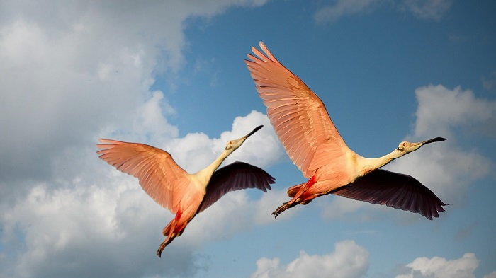
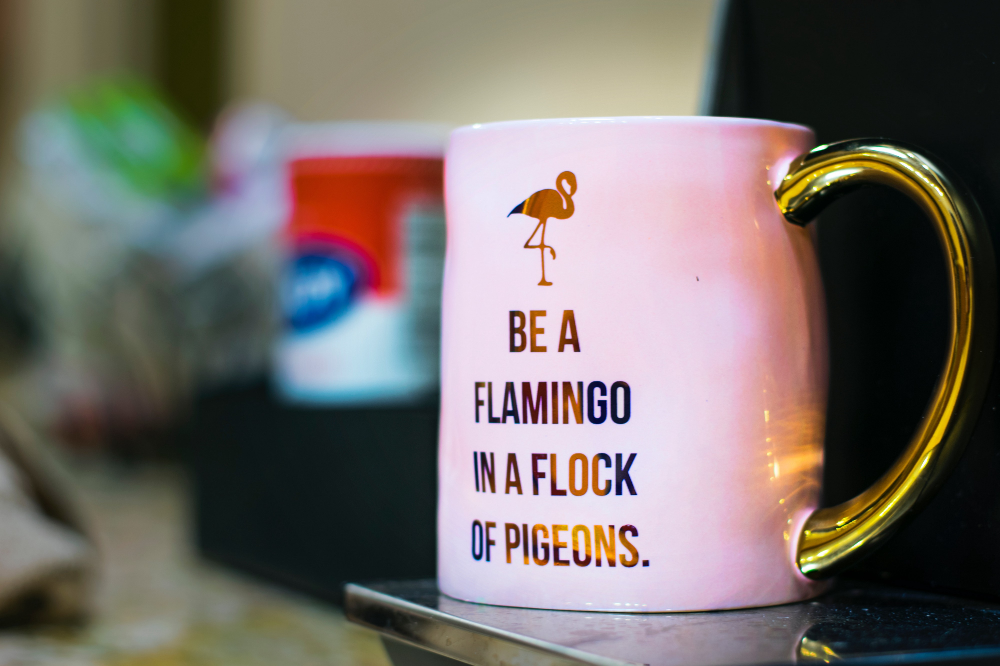

To decipher the meaning of this saying, we need to start at the beginning.

Flamingos are beautiful pink birds with unusual pink colored feathers.
They are also unique for their “standing on one leg” pose, which no one knows for sure what it serves for.

These birds can be found on almost every continent, but their uniqueness makes them a special experience for everyone lucky enough to see them in the wild. They live in large flocks and are very social birds.

Because of these traits and their uniqueness, they are considered a rare and unusual appearance.

On the other hand, pigeons are widely spread birds, as well, but they are a way more common sight than seeing flamingos. The reason is the fact they share their habitat with humans, unlike the flamingos which live in the wild.
Every one of us sees pigeons on a daily basis.

Pigeons are also beautiful birds, but in comparison to flamingos, they appear dull and uninteresting. The reason for that is the fact that flamingos are birds most of us see on scientific shows, or in movies, and we can see pigeons on every corner.

Pigeons are so habituated to living in human presence, that they almost don’t show any sign of fear even in close vicinity to people.

They can also be very annoying and are usually considered dirty and disease-carrying birds.

When these facts are taken into consideration, the conclusion is easy. Being a flamingo among many pigeons usually means, being different from the rest of people. Being different can mean many different things.

Don’t be afraid to express your individuality. It doesn’t mean to be vulgar and shock people with your appearance and behavior.

The phrase indicates something extraordinary and unusual among ordinary and usual things and circumstances. It calls us to be originals among many copies.

To conclude, the saying **“be a flamingo in a flock of pigeons”** simply means, embrace yourself and your individuality and authenticity, and others will accept and love you for that.
